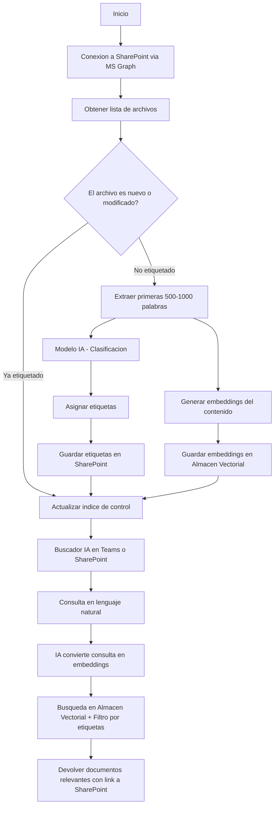

# 🏷️ Proceso de Etiquetado Automático de Documentos  

Este proceso tiene como objetivo **asignar etiquetas inteligentes a documentos** almacenados en OneDrive, evitando depender de rutas o carpetas rígidas.  
El flujo se basa en el uso de un modelo de IA para analizar los archivos, clasificarlos y generar etiquetas útiles para búsquedas posteriores.  

## 🔄 Flujo del proceso  

