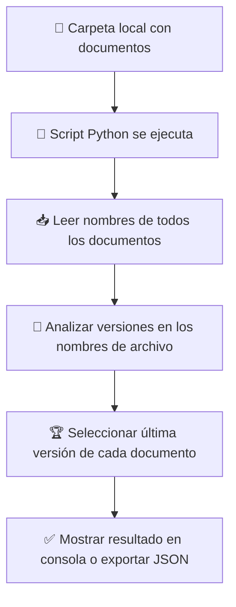

# 📄 Proceso de Detección de Última Versión de un Documento

Este proceso tiene como objetivo **identificar la versión más reciente de cada documento** dentro de una carpeta de trabajo.  
Es útil para mantener un repositorio organizado y asegurarse de trabajar siempre con la versión más actual de cada archivo, evitando confusiones con duplicados o versiones antiguas.

## 🔄 Flujo del proceso

