# 📄 Proceso de Detección de Última Versión de un Documento

Este proceso tiene como objetivo **identificar la versión más reciente de cada documento** dentro de una carpeta de trabajo.  
Es útil para mantener un repositorio organizado y asegurarse de trabajar siempre con la versión más actual de cada archivo, evitando confusiones con duplicados o versiones antiguas.

## 🔄 Flujo del proceso

```mermaid
flowchart TD
    A[📂 Carpeta local con documentos] --> B[🔄 Script Python se ejecuta]
    B --> C[📥 Leer nombres de todos los documentos]
    C --> D[🔢 Analizar versiones en los nombres de archivo]
    D --> E[🏆 Seleccionar última versión de cada documento]
    E --> F[✅ Mostrar resultado en consola o exportar JSON]
```

